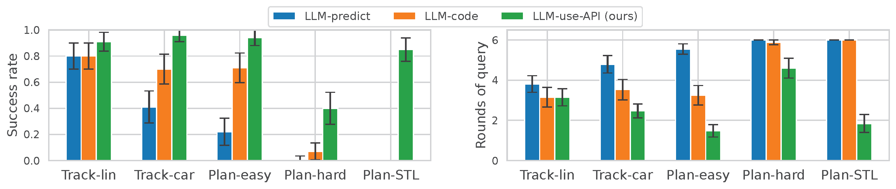
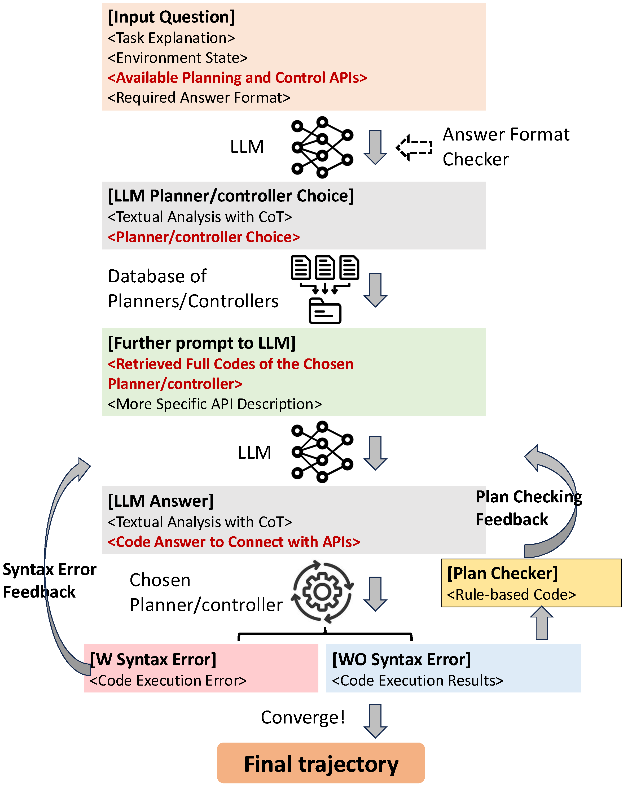

# AuDeRe: Automated Strategy Decision and Realization in Robot Planning and Control via LLMs

[](https://arxiv.org/abs/2504.03015)
[](https://cdc2025.ieeecss.org/)

[<ins>Reliable Autonomous Systems Lab @ MIT (REALM)</ins>](https://aeroastro.mit.edu/realm/)

[<ins>Yue Meng*</ins>](https://mengyuest.github.io/), [<ins>Fei Chen*</ins>](https://aeroastro.mit.edu/realm/team/fei-chen/), [<ins>Yongchao Chen</ins>](https://yongchao98.github.io/YongchaoChen/), [<ins>Chuchu Fan</ins>](https://chuchu.mit.edu/)

> An LLM framework that can choose proper APIs and code the required interfaces to implement the algorithm for solving planning and control tasks.



Our method (LLM-use-API) achieves higher task success rate with less round-of-query.




## Prerequisite
### Setup Azure OpenAI account

1. Get an Azure OpenAI account from [here](https://azure.microsoft.com/en-us/products/ai-services/openai-service).

2. Deploy OpenAI models in Azure AI Foundry following this [link](https://learn.microsoft.com/en-us/azure/ai-foundry/how-to/deploy-models-openai).
    * `gpt-4o`
    * `gpt-4o-mini`
    * `gpt-o1`
    * `gpt-o3-mini`

3. Set environmental variables `AZURE_OPENAI_API_KEY` and `AZURE_OPENAI_ENDPOINT`.
```bash
# These are not real KEY/ENDPOINT!
export AZURE_OPENAI_API_KEY="AB1CdeFghIjkL2NoPQrsTuVw3xYzaBcDe4FGhi5jkl67oPqrS8tUVWXY90ZABCDeFgHIJ1k2LMNOPQRStU3V"
export AZURE_OPENAI_ENDPOINT="https://xxx-openai.openai.azure.com/"
```

### Setup Gurobi license
Follow this [link](https://www.gurobi.com/features/academic-wls-license) to get the Gurobi license and paste the content in `~/gurobi.lic`.

### Install required packages: 
```bash
conda create -y -n audere python=3.10.16
conda activate audere
conda install -y pytorch==1.13.1 matplotlib imageio numpy==1.26.4 -c pytorch
pip install casadi gurobipy openai tiktoken seaborn 
```


## Main experiments
(results will be saved under `./exps` directory)
```bash
##### Compare LLM-End2End, LLM-Code, and LLM-use-API (ours)
python run_llm_test.py -e task0_e2e --task_type 0 --llm_mode END2END
python run_llm_test.py -e task0_code --task_type 0 --llm_mode CODE
python run_llm_test.py -e task0_api --task_type 0 --llm_mode API

python run_llm_test.py -e task1_e2e --task_type 1 --llm_mode END2END
python run_llm_test.py -e task1_code --task_type 1 --llm_mode CODE
python run_llm_test.py -e task1_api --task_type 1 --llm_mode API

python run_llm_test.py -e task4_e2e --task_type 4 --llm_mode END2END
python run_llm_test.py -e task4_code --task_type 4 --llm_mode CODE
python run_llm_test.py -e task4_api --task_type 4 --llm_mode API

python run_llm_test.py -e task3_e2e --task_type 3 --llm_mode END2END
python run_llm_test.py -e task3_code --task_type 3 --llm_mode CODE
python run_llm_test.py -e task3_api --task_type 3 --llm_mode API

python run_llm_test.py -e task0_e2e_uni --task_type 0 --llm_mode END2END -D unicycle
python run_llm_test.py -e task0_code_uni --task_type 0 --llm_mode CODE -D unicycle
python run_llm_test.py -e task0_api_uni --task_type 0 --llm_mode API -D unicycle
```

## Ablation experiments
```bash
##### LLM with different temperatures
python run_llm_test.py -e task0_api_tau.0 --task_type 0 --llm_mode API -tau 0.0
python run_llm_test.py -e task0_api_tau.2 --task_type 0 --llm_mode API -tau 0.2
python run_llm_test.py -e task0_api_tau.3 --task_type 0 --llm_mode API -tau 0.3
python run_llm_test.py -e task0_api_tau.5 --task_type 0 --llm_mode API -tau 0.5
python run_llm_test.py -e task0_api_tau.7 --task_type 0 --llm_mode API -tau 0.7
python run_llm_test.py -e task0_api_tau1 --task_type 0 --llm_mode API -tau 1.0
python run_llm_test.py -e task0_api_tau1.2 --task_type 0 --llm_mode API -tau 1.2
python run_llm_test.py -e task0_api_tau1.5 --task_type 0 --llm_mode API -tau 1.5

##### Different LLM models
python run_llm_test.py -e task3_api_gpt-4o-mini --task_type 3 --llm_mode API -M gpt-4o-mini
python run_llm_test.py -e task3_api_gpt-o1 --task_type 3 --llm_mode API -M o1
python run_llm_test.py -e task3_api_gpt-o3-mini --task_type 3 --llm_mode API -M o3-mini

##### Compare with LLM with all APIs given at first
python run_llm_test.py -e task0_api_all --task_type 0 --llm_mode API --all_apis
python run_llm_test.py -e task1_api_all --task_type 1 --llm_mode API --all_apis
python run_llm_test.py -e task4_api_all --task_type 4 --llm_mode API --all_apis
python run_llm_test.py -e task3_api_all --task_type 3 --llm_mode API --all_apis
python run_llm_test.py -e task0_api_uni_all --task_type 0 --llm_mode API -D unicycle --all_apis
```

## Figure plotting
```bash
python plot_figures.py
```

## Reference
```
@inproceedings{meng2025audere,
  title={AuDeRe: Automated Strategy Decision and Realization in Robot Planning and Control via LLMs},
  author={Meng, Yue and Chen, Fei and Chen, Yongchao and Fan, Chuchu},
  journal={arXiv preprint},
  year={2025},
}
```
